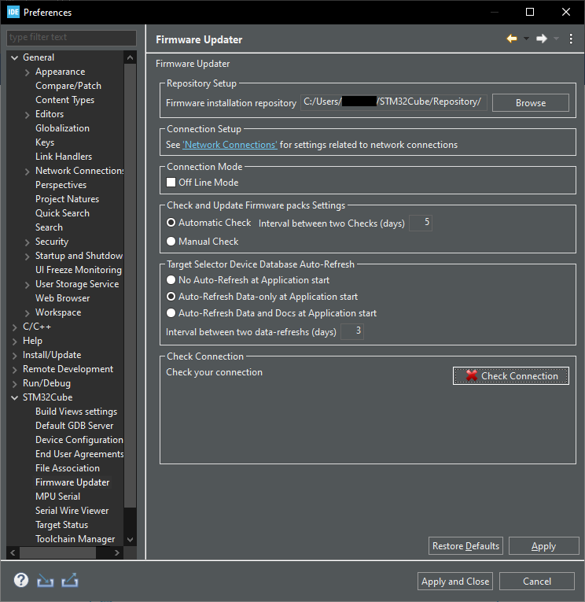
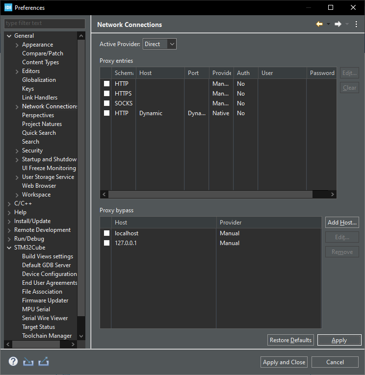
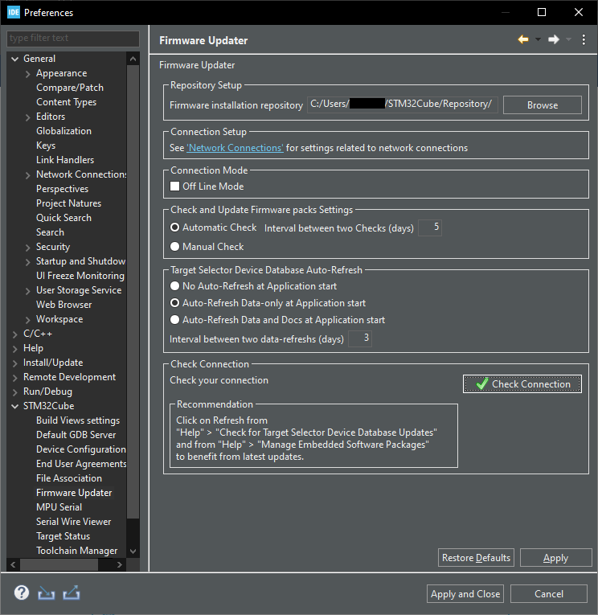

# Fixing STM32CubeIDE Connection Issue

## 1. Error Description

The STM32CubeIDE log file is located at:

    C:\Users\[USER]\STM32CubeIDE\workspace_[VERSION]\.metadata\.ide.log

### Version 1.19.0

    [INFO] MainUpdater:2872 - connection check result : 22

### Version 1.12.1

The log contains more detailed information:

    [ERROR] ServerAccessManage:1172 - Problem during Server Connection : IO error PKIX path building failed:
    sun.security.provider.certpath.SunCertPathBuilderException:
    unable to find valid certification path to requested target

    [INFO] MainUpdater:2854 - connection check result : 22

This indicates a missing or outdated root certificate in the Windows
certificate store.

------------------------------------------------------------------------

## 2. Configuration Screenshots

[](img/b.png)

[](img/0.png)

------------------------------------------------------------------------

## 3. Update Certificate Script

Download the certificate update script from the repository:

[Download root_update.cmd](./root_update.cmd)

Or run the following commands from **Command Prompt with Administrator
privileges**:

``` cmd
certutil -generateSSTFromWU C:\Rootstore.sst
certutil -addstore -f Root C:\Rootstore.sst
del C:\Rootstore.sst
```

This will refresh the Windows Root Certificate Store from Windows
Update.

------------------------------------------------------------------------

## 4. Confirmation

Successful configuration after certificate update:

[](img/1.png)
